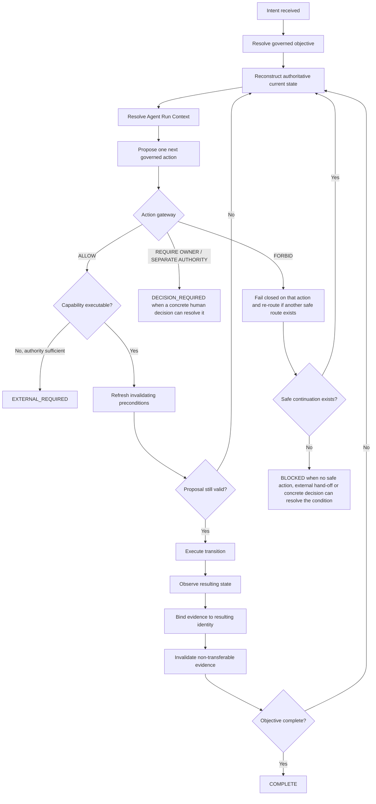

# `/go` lifecycle

This guide is an architectural map of Promptbook's governed `/go` lifecycle. It explains how the existing workflow contracts fit together; it does not replace or override them.

The normative owners remain:

- [Workflow router](../prompts/workflows/README.md) for `/go` command semantics, routing, continuation modes, terminal states and next-invocation behaviour;
- [Resolved Agent Run Context](../prompts/workflows/resolved-agent-run-context.md) for derived `/go` execution state, capability ceilings and the `/go` action gateway;
- [Autonomous progression](../prompts/workflows/autonomous-progression.md) for routine progression, re-resolution, evidence binding and escalation behaviour;
- [Capability availability overrides](../prompts/workflows/capability-availability-overrides.md) for deterministic capability-availability narrowing after action authority has been resolved; and
- [Fresh independent review](../prompts/workflows/fresh-independent-review.md) for review freshness and independence boundaries.

Repository-local instructions, explicit task authority, current authoritative evidence and platform safety constraints remain higher precedence than this explanatory guide.

## Mental model

`/go` is not a linear "implement, review, merge" pipeline. It is a governed continuation loop:

```text
intent
  -> resolve governed objective
  -> reconstruct authoritative current state
  -> resolve ephemeral Agent Run Context
  -> propose exactly one next governed action
  -> classify that action through the /go action gateway
  -> resolve capability availability when applicable
  -> refresh action-invalidating preconditions
  -> execute one authorised transition
  -> observe the actual result
  -> bind evidence to the resulting state / immutable identity
  -> invalidate evidence that does not transfer
  -> re-resolve current state
  -> continue while safely authorised and executable
```

The loop exists because each consequential transition can create a new candidate, result identity, review state, validation state, capability condition or authority boundary. Success at one step is evidence about that step; it is not ambient permission for what comes next.

## State machine



The diagram is conceptual. The router and operation-specific workflows determine the exact route for a real task.

## Stages

| Stage | Purpose | Key rule |
| --- | --- | --- |
| Intent | Interpret `/go [target]` and qualifiers | The command selects continuation intent; it does not grant unrelated authority. |
| Objective resolution | Bind the complete governed lifecycle object | Prefer an issue or equivalent objective that can reconstruct the whole lifecycle rather than an intermediate artefact when post-action work remains. |
| State reconstruction | Refresh decision-critical repository and task evidence | Conversation history may help locate authority but must not substitute for current decision-critical evidence. |
| Run-context resolution | Derive explicit execution state | Bind lifecycle state, candidate/review state where applicable, authority, capabilities, owner-decision boundaries, continuation mode, evidence requirements and completion conditions. |
| Action proposal | Select exactly one next governed transition | `next_governed_action` is a proposal, not permission to execute. |
| Action gateway | Classify authority for the exact transition | Only `ALLOW` may execute; missing or ambiguous authority never defaults to `ALLOW`. |
| Capability narrowing | Determine whether an allowed action is executable here | Technical availability can remove executable capability but cannot create authority. |
| Precondition refresh | Recheck the state that could invalidate execution | A moved candidate, changed policy, stale approval or failed check can invalidate the proposed transition. |
| Execution | Perform one consequential action | Execute only the exact action that remains authorised and available. |
| Result reconciliation | Observe what actually happened | An attempted transition and a successful transition are different states. |
| Evidence binding | Attach evidence to the state for which it was observed | Candidate-bound evidence does not silently become result-bound evidence. |
| Re-resolution | Derive the next current state | A consequential result invalidates stale derived execution state and independently gates later consequences. |

## The action gateway

Every consequential `/go` transition is classified before execution:

```text
proposed action
    |
    v
higher-precedence rule or /go ceiling prohibits it?
    | yes -> FORBID
    |
    no
    v
current authority insufficient, ambiguous, stale,
or dependent on a genuine owner/product/architecture/security/scope decision?
    | yes -> REQUIRE OWNER / SEPARATE AUTHORITY
    |
    no
    v
current authoritative sources permit this exact action
inside the governed objective?
    | yes -> ALLOW
```

The three outcomes mean different things:

- `ALLOW` — the exact transition is authorised, subject to refreshed preconditions and execution feasibility;
- `REQUIRE OWNER / SEPARATE AUTHORITY` — the transition may be legitimate, but current authority is insufficient; and
- `FORBID` — the transition cannot execute under the current `/go` contract or higher-precedence authority.

`FORBID` is a classification of the proposed action, not automatically the conversational terminal state `BLOCKED`. The router may be able to choose another safe action. `BLOCKED` applies only when no safe autonomous action, complete external hand-off or concrete human decision can resolve the condition now.

## Authority and capability are separate

Promptbook deliberately separates permission from mechanism:

```text
tool available
    !=
action authorised
```

and:

```text
action authorised
    !=
action executable in the current environment
```

Capability availability is therefore resolved after the action passes the authority gateway. A disabled, unavailable or conservatively unresolved capability can turn an authorised local action into an `EXTERNAL_REQUIRED` boundary, but it must not turn an unauthorised action into `ALLOW` or manufacture a new owner decision.

This separation is particularly important for fragile platform transitions: an unavailable connector operation is an execution constraint, not evidence that the human must re-approve an action that is already authorised.

## Immutable identity and evidence

A consequential action frequently changes the identity to which evidence applies.

```text
candidate A
  + review/validation evidence for A
  + authorised transition
  -> result B
```

The evidence for A remains valid historical evidence about A. It does not automatically prove B.

Examples include:

- remediation producing a new candidate commit;
- merge producing a merge/result commit distinct from the reviewed head;
- a deployment producing a runtime/result identity distinct from the build candidate; or
- an external operation returning a new observed lifecycle state.

After the transition, `/go` should bind the observed result to B, invalidate derived state that no longer transfers, and re-resolve before the next consequential action. This is why "approved candidate" and "objective complete" are intentionally different states.

## Continuation

The workflow router owns continuation preference. `/go` defaults to `auto`, which means it should enter the next safely authorised and executable same-context workflow without waiting for a routine human `proceed` message.

`auto` does not cross hard boundaries. In particular, it cannot create authority, weaken validation, bypass repository policy, ignore failed checks, cross a required genuinely fresh review boundary, or convert an unavailable capability into an available one.

The intended ordinary shape is:

```text
resolve
  -> authorised action
  -> observe result
  -> re-resolve internally
  -> next authorised action
```

An ordinary lifecycle milestone should not become:

```text
resolve
  -> intermediate status
  -> stop
  -> human types /go
  -> reconstruct the same decision-critical state
```

unless a real boundary requires that stop.

## Conversational terminal states

A routed objective ends only in one of four terminal states:

| State | Meaning |
| --- | --- |
| `COMPLETE` | The governed objective is genuinely finished, including required verification and close-out. |
| `DECISION_REQUIRED` | A genuine human judgement or new authority decision is required. |
| `EXTERNAL_REQUIRED` | Existing authority is sufficient, but the required action cannot legitimately execute in the current environment; the response must provide a complete bounded hand-off. A genuinely fresh-context hand-off is a special case. |
| `BLOCKED` | No safe autonomous action, executable external hand-off or concrete human decision can resolve the condition now. |

These are not terminal by themselves:

- implementation complete;
- validation passed;
- pull request ready;
- review ready;
- review approved;
- merge ready; or
- merge complete.

Those are lifecycle observations that may determine the next transition.

## Representative traces

The following generic traces capture recurring classes of real governed execution without depending on private repository history.

### 1. Authorised action, unavailable capability

```text
state reconstructed
  -> exact lifecycle transition proposed
  -> action gateway: ALLOW
  -> configured/runtime capability unavailable
  -> EXTERNAL_REQUIRED with one bounded executable hand-off
```

**Primary friction source:** capability availability or execution substrate.

**Not an authority problem:** the owner should not be asked to approve the same already-authorised transition merely because the connector cannot perform it.

### 2. Review changes required, bounded remediation, fresh re-review

```text
candidate A
  -> fresh review: CHANGES REQUIRED
  -> bounded remediation already authorised
  -> /fix produces candidate B
  -> validation bound to B
  -> authoring context is no longer fresh for B
  -> EXTERNAL_REQUIRED: fresh-context /review of exact candidate B
```

**Primary friction source:** genuine freshness boundary.

**Expected stop:** the fresh-context hand-off is not unnecessary orchestration; it protects independent review.

### 3. Approved candidate, separately authorised merge, post-merge evidence

```text
candidate A
  -> fresh review: APPROVED
  -> merge authority independently established
  -> refresh exact head/checks/policy
  -> merge A
  -> observe result B
  -> retain review/check evidence as evidence about A
  -> collect required post-merge evidence for B
  -> re-resolve completion/close-out
```

**Primary friction source:** evidence rebinding and distinct consequence authorities.

**Simplification target:** avoid stopping merely because merge succeeded; continue into already-authorised verification and close-out.

### 4. Ordinary same-context continuation

```text
current state
  -> next action safely determined
  -> action gateway: ALLOW
  -> capability available
  -> execute
  -> observe result
  -> re-resolve
  -> next action also safely determined
  -> continue automatically
```

**Primary friction source when this stops early:** routing or continuation policy.

**Simplification target:** remove conversational stops that carry no new decision, environment or freshness boundary.

### 5. Genuine new owner decision

```text
current state
  -> next plausible transition changes material scope/security/architecture/outcome
  -> action gateway: REQUIRE OWNER / SEPARATE AUTHORITY
  -> DECISION_REQUIRED with one bounded decision capsule
```

**Primary friction source:** none; this is intentional human judgement.

**Control to preserve:** do not disguise the decision as a capability problem or silently pick a materially new outcome.

### 6. Prohibited or irreconcilable transition

```text
current state
  -> proposed action conflicts with higher-precedence policy
  -> action gateway: FORBID
  -> re-route if another safe governed action exists
  -> otherwise BLOCKED when no safe action, external hand-off or concrete decision can resolve the condition
```

**Primary friction source:** hard governance boundary or irreconcilable state.

**Control to preserve:** do not manufacture `/go`, `/fix`, approval or an external procedure merely to create motion.

## Friction taxonomy

When `/go` requires human intervention, classify the cause before changing the workflow:

| Cause | Typical symptom | Likely response |
| --- | --- | --- |
| Routing / continuation | Stops at an ordinary lifecycle gate although the next action is already safe and executable | Remove the accidental stop or restore router control under `auto`. |
| Authority | Exact consequential action is not currently permitted | Preserve or present the bounded authority decision. |
| Freshness | Current context authored or materially shaped a candidate requiring independent review | Preserve the fresh-context hand-off. |
| Capability | Action is authorised but the local mechanism is unavailable or broken | Use the bounded `EXTERNAL_REQUIRED` path; do not manufacture re-approval. |
| Evidence identity | Previous evidence is attached to a different immutable state | Rebind or collect result-specific evidence, then continue. |
| Validation | Required checks are missing, stale or failed | Refresh/run required validation; do not continue through a failed control. |
| Irreconcilable governance | Higher-precedence rules prohibit the proposed path and no alternative is currently resolvable | Fail closed and use `BLOCKED` only when its full definition is met. |
| Genuine owner judgement | Multiple materially different outcomes remain or a consequential boundary needs explicit authority | Use `DECISION_REQUIRED`. |

## Simplification opportunities

The current architecture suggests several useful follow-on investigations. These are assessment findings, not behavioural changes made by this guide.

1. **Eliminate ordinary intermediate conversational stops.** Audit places where a workflow returns a local success/status record but fails to return control to the router under `/go`'s `auto` continuation mode.
2. **Standardise post-action resume.** After every consequential action, use one consistent result-binding and re-resolution pattern so merge, metadata transitions and other successful operations do not accidentally become terminal.
3. **Keep capability failure out of the authority path.** Where an action is already `ALLOW`, an unavailable mechanism should consistently project to `EXTERNAL_REQUIRED` rather than a new `DECISION_REQUIRED` or repeated capability probe.
4. **Make freshness boundaries explicit and narrow.** Preserve genuinely fresh re-review while avoiding broader context resets when only one decision surface requires independence.
5. **Use transition traces as regression fixtures for later behaviour changes.** Behavioural changes should demonstrate which trace improves and which hard boundaries remain invariant.

Any semantic change resulting from these investigations should be separately governed and should add targeted regression coverage to the relevant Promptbook workflow tests.

## Target operating principle

> `/go` should continue automatically until it encounters a boundary that cannot safely be crossed without new human judgement, a different execution environment, a genuinely fresh context, or until the governed objective is complete.

The principle reduces unnecessary human orchestration without weakening authority, evidence, validation, security, freshness or fail-closed behaviour.